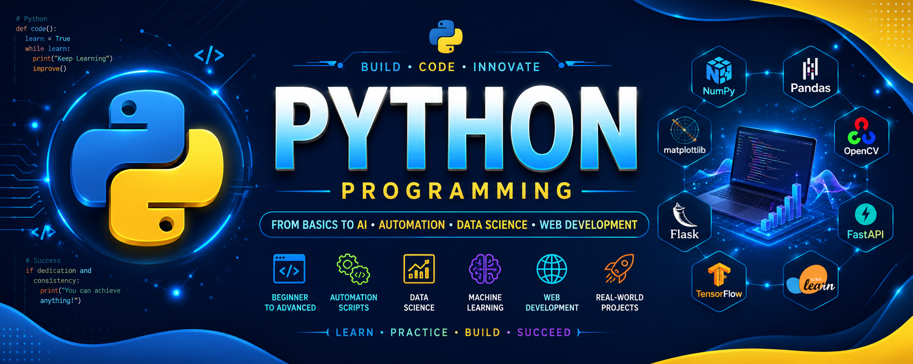

<p align="center">
  
</p>

<h1 align="center">🐍 Python Programming</h1>

<h3 align="center">
From Basics to AI • Automation • Data Science • Web Development
</h3>

<p align="center">

</p>

<p align="center">


</p>

---

# 📊 Repository Statistics

<p align="center">


</p>

<p align="center">


</p>

---

# 📖 About

Welcome to my **Python Programming Repository**.

This repository contains Python programs from **beginner to advanced**, covering core programming concepts, object-oriented programming, automation, web development, data science, artificial intelligence, and machine learning.

It is designed as a complete Python learning repository for students, beginners, and developers who want to build real-world applications.

---

# 🎯 Learning Objectives

- Learn Python from Beginner to Advanced
- Master Object-Oriented Programming (OOP)
- Build Automation Scripts
- Learn File Handling & Exception Handling
- Explore Data Science with NumPy & Pandas
- Develop Web Applications using Flask & FastAPI
- Learn Machine Learning & Artificial Intelligence
- Solve Real-World Programming Problems
- Prepare for Technical Interviews

---

# 📚 Topics Covered

## 🟢 Python Basics

- Variables
- Data Types
- Operators
- Input & Output
- Conditional Statements
- Loops

## 🔵 Intermediate Python

- Functions
- Modules
- Packages
- Lists
- Tuples
- Dictionaries
- Sets
- Strings
- Pattern Programs
- Recursion

## 🟠 Object-Oriented Programming

- Classes
- Objects
- Constructors
- Inheritance
- Polymorphism
- Encapsulation
- Abstraction

## 🟣 Advanced Python

- File Handling
- Exception Handling
- Regular Expressions
- Multithreading
- Virtual Environments
- API Requests
- JSON

## 🟡 Data Science

- NumPy
- Pandas
- Matplotlib
- Seaborn
- Data Analysis

## 🔴 Artificial Intelligence

- OpenCV
- TensorFlow
- Machine Learning
- Deep Learning
- Computer Vision

## 🌐 Web Development

- Flask
- FastAPI
- REST APIs

---

# 🛠 Technologies Used

<p align="center">


</p>

---

# 📈 Learning Progress

```text
Python Basics       ████████████████████ 100%
OOP                 ███████████████████░ 95%
Data Structures     ██████████████████░░ 90%
File Handling       █████████████████░░░ 85%
Flask               ██████████████░░░░░░ 70%
FastAPI             ███████████████░░░░░ 75%
NumPy               █████████████░░░░░░░ 65%
Pandas              ████████████░░░░░░░░ 60%
OpenCV              █████████░░░░░░░░░░░ 45%
TensorFlow          ███████░░░░░░░░░░░░░ 35%
Machine Learning    ██████░░░░░░░░░░░░░░ 30%
```

---

# 🗺️ Python Learning Roadmap

```text
          PYTHON PROGRAMMING

                │
                ▼
         Variables & Data Types
                │
                ▼
             Operators
                │
                ▼
         Conditional Statements
                │
                ▼
               Loops
                │
                ▼
        Functions & Modules
                │
                ▼
    Lists • Tuples • Dictionaries
                │
                ▼
      Object-Oriented Programming
                │
                ▼
      File & Exception Handling
                │
                ▼
            NumPy & Pandas
                │
                ▼
             Flask & FastAPI
                │
                ▼
        Machine Learning Basics
                │
                ▼
          Deep Learning & AI
                │
                ▼
      Real-World Python Projects
```

---

# 🚀 Featured Python Projects

| Project | Description |
|---------|-------------|
| 🤖 AI Chatbot | Intelligent chatbot using Python. |
| 👁 Face Recognition | Face detection using OpenCV. |
| 🔐 File Encryption System | Encrypt and decrypt files securely. |
| 📊 Data Analysis | Analyze datasets using Pandas & NumPy. |
| 🌐 FastAPI REST API | Backend APIs using FastAPI. |
| 📷 Image Processing | Image manipulation using OpenCV. |
| 🤖 Machine Learning Projects | Prediction and classification models. |

---

# 💼 Python Skills

| Skill | Status |
|-------|:------:|
| Python Basics | ✅ |
| OOP | ✅ |
| Functions | ✅ |
| Modules | ✅ |
| File Handling | ✅ |
| Exception Handling | ✅ |
| NumPy | 🟡 Learning |
| Pandas | 🟡 Learning |
| Flask | 🟡 Learning |
| FastAPI | 🟡 Learning |
| OpenCV | 🔄 Coming Soon |
| TensorFlow | 🔄 Coming Soon |
| Machine Learning | 🔄 Coming Soon |
| Deep Learning | 🔄 Coming Soon |

---

# 🚀 Future Plans

- 🤖 Artificial Intelligence
- 🧠 Machine Learning
- 📊 Data Science
- 👁 Computer Vision
- ⚡ FastAPI Projects
- 🌐 Flask Projects
- ☁ Cloud Deployment
- 🐳 Docker
- 🔄 CI/CD
- 🚀 Real-World Python Applications

---

# 📚 Learning Resources

- Python Official Documentation
- Real Python
- W3Schools Python
- GeeksforGeeks Python
- FastAPI Documentation
- Flask Documentation
- NumPy Documentation
- Pandas Documentation
- OpenCV Documentation
- TensorFlow Documentation

---

# 🤝 Contributing

Contributions, suggestions, and improvements are always welcome.

If you'd like to contribute:

1. Fork the repository
2. Create a new branch
3. Commit your changes
4. Push your branch
5. Open a Pull Request

---

# ⭐ Support

If you find this repository useful, consider giving it a ⭐.

Happy Coding! 🐍🚀
